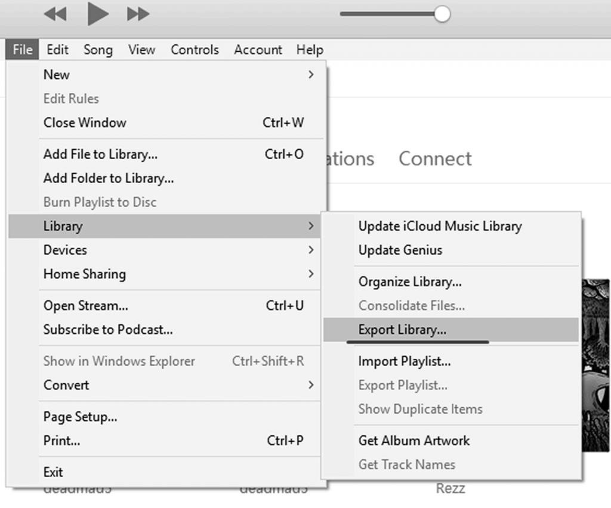

# About

Provides API integration with [Spotify](https://en.wikipedia.org/wiki/Spotify)

After running the iTunesDB parser application on an iTunesDB file, you end up with a music CSV file that contains info about your songs. This tool lets you then import that CSV file into a Spotify playlist.

You can also use this tool with your exported iTunes library in XML.




## Code usage

Install dependencies

```bash
$ pip install -r requirements.txt
```

```
usage: spotify_integration.py [-h] -i INPUT_FILE [-t TRACK_COLUMN] -a API_CREDENTIALS_FILE

Read CSV or iTunesXML files containing songs and search for them in Spotify

options:
  -h, --help            show this help message and exit
  -i INPUT_FILE, --input-file INPUT_FILE
                        Path to either 1) the CSV file exported by iTunesDB parser or 2) an XML file exported from iTunes file. The extension is used to
                        determine the procedure
  -t TRACK_COLUMN, --track-column TRACK_COLUMN
                        Name of the column containing the track names, only required if CSV files are used
  -a API_CREDENTIALS_FILE, --api-credentials-file API_CREDENTIALS_FILE
                        Path to JSON file containing API credentials, see spotify_api_credentials.json for the format

```

# API instructions


See: https://developer.spotify.com/documentation/web-api/concepts/apps
for instructions on how to generate API credentials to use with this.

There is an example JSON credential file in the repo so you can see the format required.

After running you will be sent to a authorization prompt in your browser and then redirected to a URL

The application will ask you to paste that URL to retrieve the code that is embedded in the URL.
